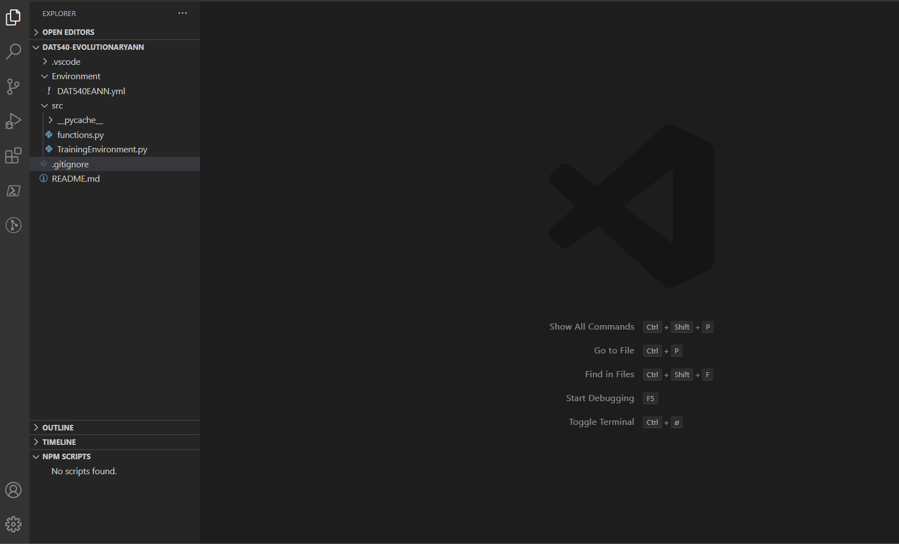
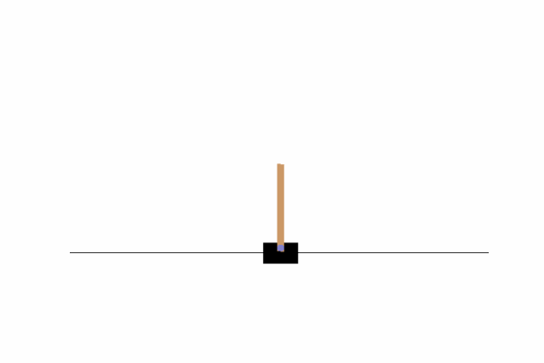
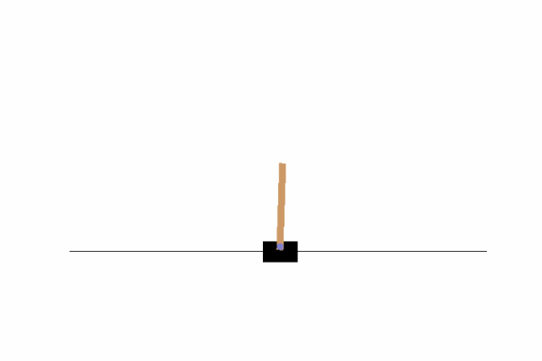
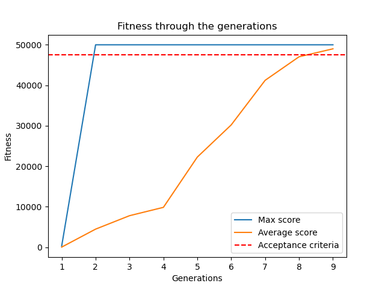

# DAT540-EvolutionaryANN
Project in DAT540 for exploring evolutionary ANNs in OpenAI's cartpole environment.

## Group Members
* [Bjørn Christian Weinbach](https://github.com/bcwein) - Data Science
* [Marius Sørensen](https://github.com/sorensenmarius) - Data Science
* [Ove Jørgensen](https://github.com/ovejorgensen) - Data Science
* [Håvard Godal](https://github.com/HGodal) - Data Science
* [Johanna Kinstad](https://github.com/johannakinstad) - Data Science
* [Vegard Rongve](https://github.com/VRongve) - Data Science

## Anaconda Environment
To organise the libraries utilised in our project. A anaconda environment is stored in the folder "Environment". 

For a deeper explanation of managing environments. see the documentation [here](https://docs.conda.io/projects/conda/en/latest/user-guide/tasks/manage-environments.html).

### Setting up environment from file

Open anaconda command line and type 

> conda env create -f DAT540EANN.yml

Anaconda will then set up a environment with the packages specifiedin the .yml file

### Updating environment

If you need to install another package, update the environment.yml file manually and use the command

> conda env update --file DAT540EANN.yml  --prune

The --prune option causes conda to remove any dependencies that are no longer required from the environment.

##  Running the code
To run the code. Run TrainingEnvironment.py in terminal.


## Results

**Note**: Due to the stochastic nature of evolutionary algorithms, results may wary between runs.

### Agent_500


Hyperparameters used in this gif:

- Population = 50
- Generations = 15
- Mutation rate = 1 - score/total 
- Max episode steps = 500
- Acceptance rate = 95%
- Crossover: Uniform swap

Output:
```
Gen 1: Average: 40.22 | Best: 414.0
Gen 2: Average: 349.26 | Best: 500.0
Gen 3: Average: 462.9 | Best: 500.0
Gen 4: Average: 482.98 | Best: 500.0

Success in generation 5!
Current average score: 489.65
```

### Agent_1000


Hyperparameters used in this gif:

- Population = 50
- Generations = 15
- Mutation rate = 1 - score/total 
- Max episode steps = 1000
- Acceptance rate = 95%
- Crossover: Uniform swap

Output:
```
Gen 1: Average: 32.82 | Best: 375.0
Gen 2: Average: 84.98 | Best: 514.0
Gen 3: Average: 143.52 | Best: 1000.0
Gen 4: Average: 657.68 | Best: 1000.0
Gen 5: Average: 818.92 | Best: 1000.0
Gen 6: Average: 1000.0 | Best: 1000.0

Success in generation 7!
Current average score: 1000.0
```

### Agent_5000


Hyperparameters used in this gif:
- Population = 50
- Generations = 15
- Mutation rate = 1 - score/total 
- Max episode steps = 5000
- Acceptance rate = 95%
- Crossover: Uniform swap

Output:
```
Gen 1: Average: 64.86 | Best: 491.0
Gen 2: Average: 132.28 | Best: 1196.0
Gen 3: Average: 870.3 | Best: 5000.0
Gen 4: Average: 4309.12 | Best: 5000.0
Gen 5: Average: 4900.22 | Best: 5000.0

Success in generation 6!
Current average score: 4950.11
```

# Agent_50000


Hyperparameters used in this gif:
- Population = 50
- Generations = 15
- Mutation: Selective mutation with mutation rate = 0.05.
- Max episode steps = 50000
- Acceptance rate = 95%
- Crossover: Differential crossover
- Mutation: 


Output:
```
Gen 1: Average: 29.52 | Best: 294.0
Gen 2: Average: 4467.62 | Best: 50000.0
Gen 3: Average: 7784.74 | Best: 50000.0
Gen 4: Average: 9848.68 | Best: 50000.0
Gen 5: Average: 22265.28 | Best: 50000.0
Gen 6: Average: 30214.46 | Best: 50000.0
Gen 7: Average: 41225.38 | Best: 50000.0
Gen 8: Average: 47040.8 | Best: 50000.0

Success in generation 9!
Current average score: 48022.23
```